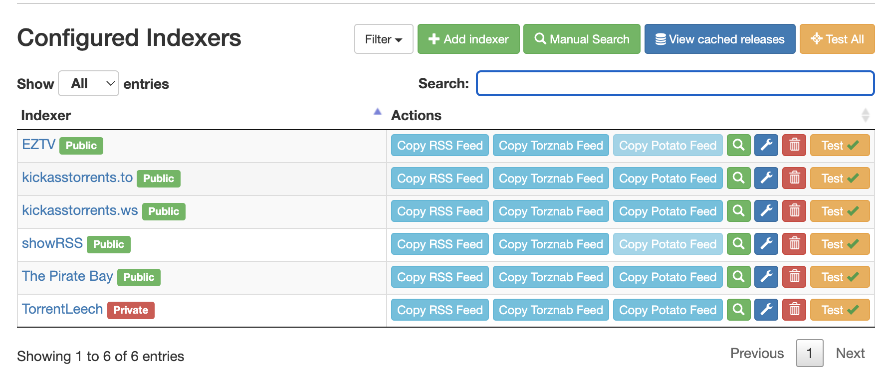
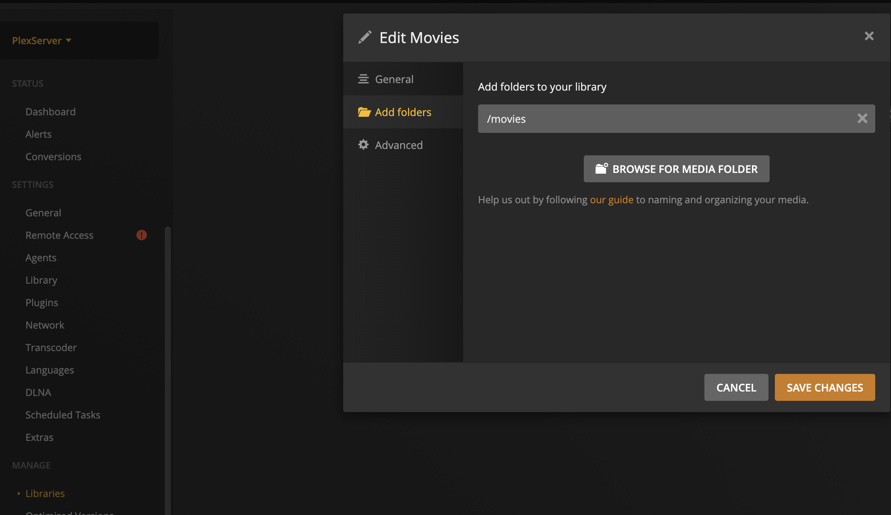
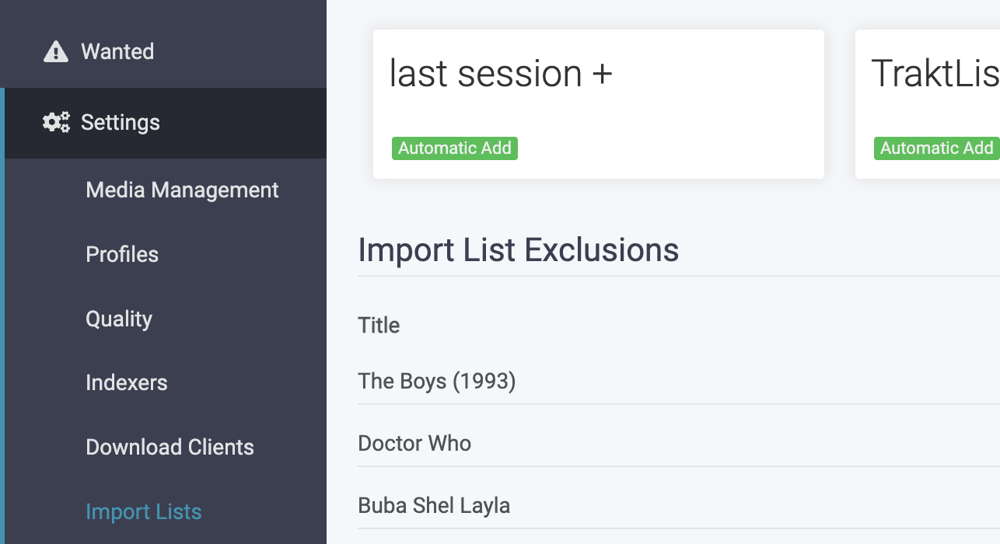
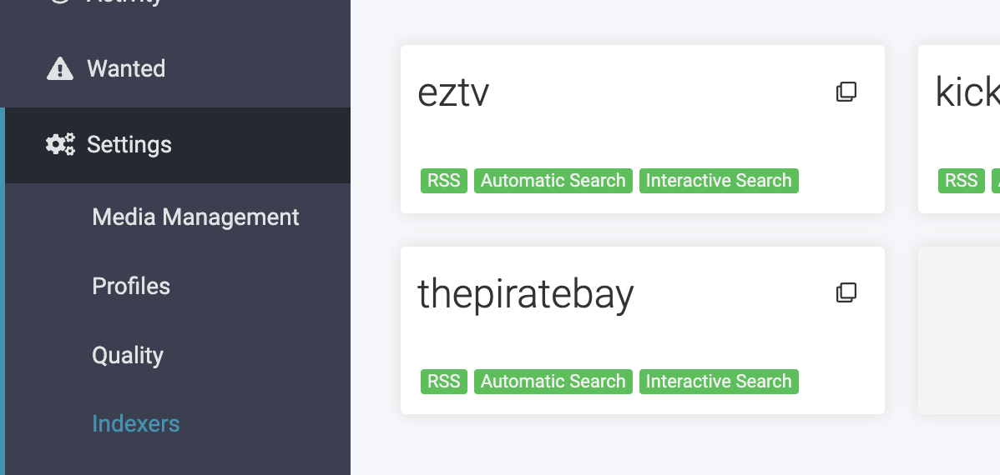
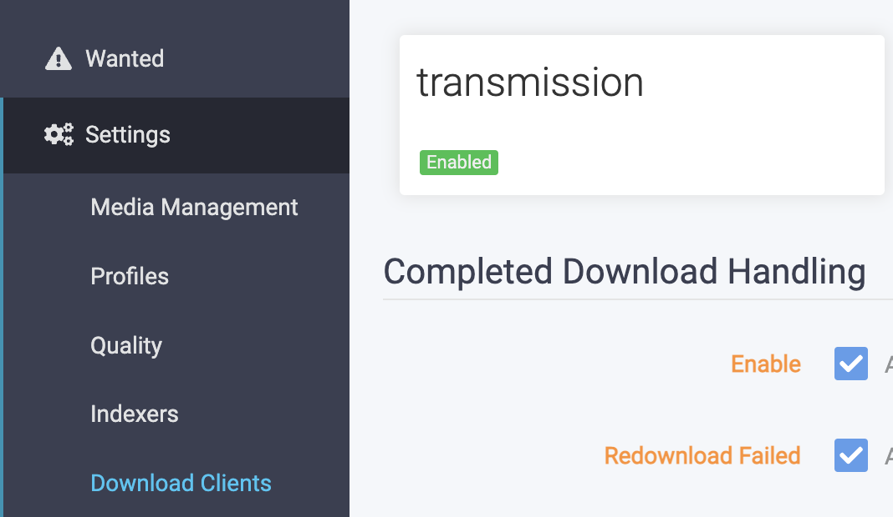

Autonumos Streaming Server
=======================
Once deployed, you will be able to add tvshows or movies to Trakt.tv list then watch them in the plex client after 24 hour (or less).
all you need is:
 - Trakt.tv account (which is free)
 - local server (old pc) with Docker to run the dockers ( you can download docker here https://www.docker.com/)

------------

# How we do this?

## Service #0: Traket.tv lists

What you need to do.
1. Create Trakt account.
2. Create list to sync to Sonarr and Radarr, you can see my lists at https://trakt.tv/users/erlichsefi/lists 

## Service #1: Trassmission to download torrents
    
What you need to do.
1. Add additional script that unzip torrent which are downloaded as zip.
   add this script path "resources/scripts/unzip.sh" in setting (resources/trassmission/torrent_config/settings.json:script-torrent-done-filename) 
   
        "script-torrent-done-enabled": true,
        "script-torrent-done-filename": "scripts/unzip.sh",
    
2. Set trassmission useranme in .env/TRANSMISSION_USER
3. Set trassmission password in .env/TRANSMISSION_PASS
4. Set trassmission hostname in .env/HOST_NAME

## Service #2: Jacket to track torrent sources and cache. 

What you need to do.
1. add trackers to Jacket, for example:
  - hebits
  - torrentleech
  - add more ...
  
 
 Here is some of my trackers, you can find the Jacket web UI at port 9117. 

## Service #3: Sonarr to orchestrate all for TV shows
Sonarr will:
- Check if Trakt for new items.
- Check new episodes avaliabe.
- Find torrent in Jacket.
- Send torrent Transmission.
- Scan Transmission download folder and orgnize it in '${VIDEO_PATH}/tv'.

What you need to do.
0. Set a path for VIDEO_PATH in .env
1. Configure sonarr to read trakt list with new TV shows.
2. Configure sonarr to query jacket once new episodes need to be download.
3. Configure in sonarr download client as transmission.

## Service #4: Ranarr to orchestrate all for TV shows
- Check if Trakt for new items.
- Check new movies avaliabe.
- Find torrent in Jacket.
- Send torrent Transmission.
- Scan Transmission download folder and orgnize it in '${VIDEO_PATH}/movies'.

What you need to do.
0. Set a path for VIDEO_PATH in .env (if you didn't before)
1. Configure radarr to read trakt list with new Movies.
2. Configure radarr to query jacket once new episodes need to be download.
3. Configure in radarr download client as transmission.

## Service #5: Flex to manage a media server.

What you need to do.
0. Get and set a free Plex path in .env and select hostname.
1. Configure movies and tv path in plex to following folders.
 - ${VIDEO_PATH}/movies
 - ${VIDEO_PATH}/tv

Bottom line,
I'm adding Movies/Tv shows to trakt.tv list, 24 hours later i can watch them in my android Flex client, every new episode that air is download automatically. 

Example for Sonarr and Radarr:

